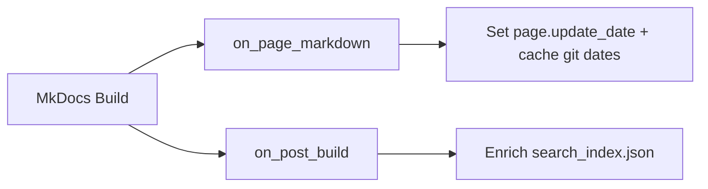

# How It Works

This page explains the enrichment pipeline and shows before/after comparisons.

## The Problem

When MkDocs builds your site, it generates two important files:

- **`sitemap.xml`** — used by search engines to discover and index your pages
- **`search/search_index.json`** — used by the built-in search to find content

By default, neither of these files contains accurate revision dates. The sitemap
may use the build date, and the search index contains no date information at all.

## The Solution

The plugin hooks into two MkDocs build events:



### Step 1: Set sitemap date early (`on_page_markdown`)

During the build, the plugin reads the git revision date that
`git-revision-date-localized-plugin` has already extracted and cached for each
page. It then updates `page.update_date` immediately (in `YYYY-MM-DD` format),
which is what MkDocs uses while rendering `sitemap.xml`.

The plugin also stores the parsed datetime in an internal cache keyed by source
path for later search index enrichment.

### Step 2: Enrich search index (`on_post_build`)

After the build completes, the plugin reads `search/search_index.json` and
adds a `last_updated` field to each entry. It uses the cached datetime from
Step 1 and falls back to direct git lookup when needed.

## Before & After

### Sitemap

**Before** (default MkDocs output):

```xml
<url>
  <loc>https://example.com/getting-started/</loc>
  <!-- No <lastmod> or uses build date -->
</url>
```

**After** (with metadata-enricher):

```xml
<url>
  <loc>https://example.com/getting-started/</loc>
  <lastmod>2025-11-03</lastmod>
</url>
```

### Search Index

**Before** (default MkDocs output):

```json
{
  "location": "getting-started/",
  "title": "Getting Started",
  "text": "Install and configure the plugin..."
}
```

**After** (with `search_date_type: datetime`, `search_locale: en`):

```json
{
  "location": "getting-started/",
  "title": "Getting Started",
  "text": "Install and configure the plugin...",
  "last_updated": "November 3, 2025 14:22:05"
}
```

The date is available as structured metadata in each search entry.

## Integration with git-revision-date-localized

This plugin does **not** read git history itself during the page-rendering
phase. Instead, it relies on
[mkdocs-git-revision-date-localized-plugin](https://github.com/timvink/mkdocs-git-revision-date-localized-plugin)
to extract and set revision dates in each page's metadata. The metadata enricher
then reads these cached dates and uses them for sitemap and search enrichment.

For the search index fallback path (cache misses), the plugin queries git
directly using:

```bash
git log -1 --format=%aI -- <filepath>
```

This returns the author date of the last commit that touched the file, in ISO
8601 format.

## SEO Benefits

Search engines like Google use `<lastmod>` in sitemaps to:

- Prioritise crawling recently updated pages
- Display "last updated" dates in search results
- Assess content freshness

By providing accurate git-based dates instead of build dates, your
documentation appears more trustworthy and up-to-date to search engines.
